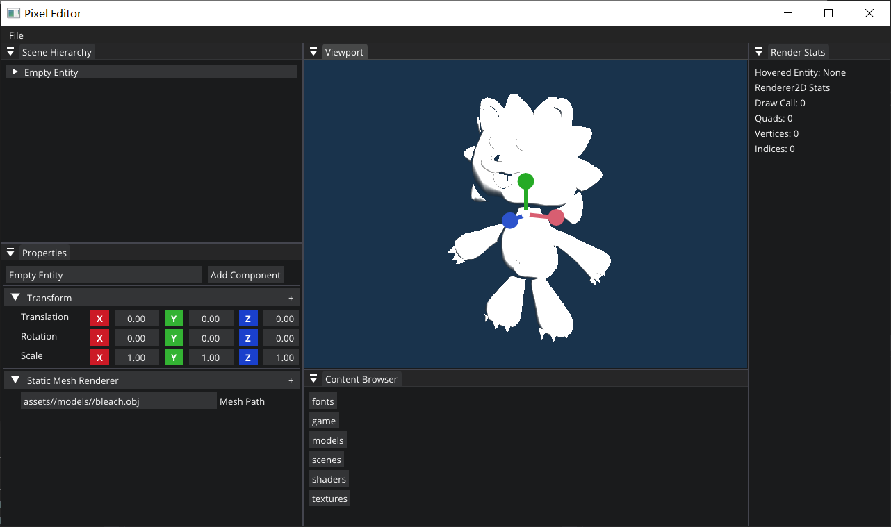

# Pixel
Pixel Game Engine

# Build and Run
`git clone https://github.com/pixel-Teee/Pixel.git`

`cd Pixel`

`git submodule update --init --recursive`

`cd scripts`

`click Win-GenProjects.bat`

Select the PixelEditor as the StartupProject

# ScreenShot

# Features

- Image-Based Lighting
- Deferred Rendering
- Bloom
- PBR
- Editor and Game Runtime
- ShadowMap
- ...
